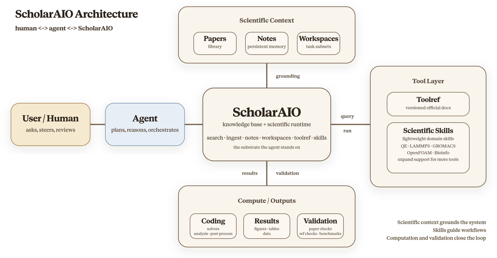

<div align="center">

<!-- TODO: 有 logo 后替换 -->
<!--  -->

# ScholarAIO

**Scholar All-In-One — 为 AI agent 打造的科研知识基础设施。**

[English](README.md) | [中文](README_CN.md)

[](https://github.com/ZimoLiao/scholaraio/stargazers)
[](LICENSE)
[](https://www.python.org/)
[](.claude/skills/)

</div>

---

你的 coding agent 已经能读代码、写代码、跑实验。ScholarAIO 给它加上一个结构化的科研工作台，于是同一个 agent 不只会写代码，也能检索文献、对照论文校验结果、更准确地使用科学软件，并在一个终端里推动完整科研流程。

它的特别之处在于：

- 你的论文库会变成同一个 agent 可持续复用的知识底座。
- 遇到科学软件问题时，agent 可以在运行时查官方文档，而不是只靠 prompt 猜参数。
- 系统从一开始就按“可继续扩展更多工具和工作流”来设计。

<div align="center">
  
</div>

ScholarAIO 给 AI coding agent 的不只是检索能力，而是一整套真正可用的科研工作台：自然语言交互、论文与研究笔记支撑、更准确的科学软件使用、代码编写与执行、基于文献的结果校验，以及结构化的论文写作。

<div align="center">
  
</div>

## 快速开始

默认、也是最推荐的使用方式很简单：安装 ScholarAIO，完成一次配置，然后直接让你的 coding agent 打开这个仓库。

```bash
git clone https://github.com/ZimoLiao/scholaraio.git
cd scholaraio
pip install -e ".[full]"
scholaraio setup
```

然后直接用 Codex、Claude Code 或其他支持的 agent 打开这个仓库即可。用这种方式，agent 能拿到最完整的体验：仓库内置指令、本地 skills、CLI 和完整代码上下文都会直接可用。Claude Code 插件、Codex/OpenClaw skills 注册，以及其他使用路径，都展开写在 [`docs/getting-started/agent-setup.md`](docs/getting-started/agent-setup.md)。

## 核心功能

|  | 功能 | 说明 |
|--|------|------|
| **PDF 解析** | 深度结构提取 | 优先使用 [MinerU](https://github.com/opendatalab/MinerU) 或 [Docling](https://github.com/docling-project/docling) 输出结构化 Markdown；若两者都不可用，ScholarAIO 会回退到 PyMuPDF 文本提取。使用 MinerU 时，本地后端会按 `chunk_page_limit`（默认 >100 页）自动切分，云端后端则同时遵循 `>600 页` 与 `>200MB` 两个限制并自动估算安全分片大小 |
| **不只是论文** | 各种文档都能入 | 期刊论文、学位论文、专利、技术报告、标准、讲义——四种 inbox 分类入库，各有针对性的元数据处理 |
| **融合检索** | 关键词 + 语义 | FTS5 + Qwen3 嵌入 + FAISS → RRF 排序融合 |
| **主题发现** | 自动聚类 | BERTopic + 6 种交互式 HTML 可视化——同时支持主库和 explore 数据集 |
| **文献探索** | 多维度发现 | OpenAlex 9 维过滤（期刊、概念、作者、机构、关键词、来源类型、年份、引用量、文献类型）→ 向量化 → 聚类 → 检索 |
| **引用图谱** | 参考文献与影响力 | 正向/反向引用、共同引用分析 |
| **分层阅读** | 按需加载 | L1 元数据 → L2 摘要 → L3 结论 → L4 全文 |
| **多源导入** | 带上你的文献库 | Endnote XML/RIS、Zotero（API + SQLite，支持 collection → workspace 映射）、PDF、Markdown——更多来源持续接入 |
| **工作区** | 按项目组织 | 论文子集管理，支持范围内检索和 BibTeX 导出 |
| **多格式导出** | BibTeX / RIS / Markdown / DOCX | 导出整个库或工作区——直接用于 Zotero、Endnote、投稿或分享 |
| **持久化笔记** | 跨会话记忆 | Agent 的分析结果按论文保存（`notes.md`），再次访问时复用已有发现，无需重读全文——省 token、不重复劳动 |
| **研究洞察** | 阅读行为分析 | 搜索热词、高频阅读论文、阅读趋势、语义近邻推荐——发现你可能忽略的文献 |
| **联邦发现** | 跨库搜索 | 一条命令同时搜索主库、explore 库和 arXiv；可直接把 arXiv PDF 拉取进 ingest 流水线 |
| **AI for Science 运行时能力** | 更准确地使用科学软件 | agent 可以通过 `toolref` 在运行时查官方接口文档；当前已覆盖 Quantum ESPRESSO、LAMMPS、GROMACS、OpenFOAM 和 curated bioinformatics 工具 |
| **可扩展工具接入** | 持续接入用户真正需要的软件 | ScholarAIO 不止支持当前这五类科学工具；它从设计上就支持继续接入新的用户需求工具，并配有专门的 onboarding 工作流 |
| **学术写作** | AI 辅助撰写 | 文献综述、论文章节、引用验证、审稿回复、研究空白分析——每条引用可追溯至你自己的文献库 |

## 不只是论文管理

ScholarAIO 把 PDF 解析成干净的 Markdown，LaTeX 公式准确，图片附件完整。这意味着你的 coding agent 不只能"读"论文，还能：

- **复现方法** — 读算法描述，写出实现，直接运行
- **验证结论** — 从图表中提取数据，独立计算，交叉核对
- **推导公式** — 接着论文的推导继续展开，用数值计算验证边界条件
- **可视化结果** — 把论文数据和你自己的实验结果画在一起对比

知识库是基础设施，agent 在此之上能做什么，取决于你的想象力。

## 兼容你的 Agent

ScholarAIO 的设计目标是 **agent 无关**，但不同 agent 的安装入口并不一样。有些更适合直接打开仓库，有些更适合走插件。

| Agent / IDE | 直接打开本仓库 | 在其他项目中复用 |
|-------------|---------------|------------------|
| [Claude Code](https://docs.anthropic.com/en/docs/claude-code) | `CLAUDE.md` + `.claude/skills/` | Claude 插件市场 |
| [Codex](https://openai.com/codex) / OpenClaw | `AGENTS.md` + `.agents/skills/` | 注册到 `~/.agents/skills/` |
| [Cline](https://github.com/cline/cline) | `.clinerules` + `.claude/skills/` | CLI + skills |
| [Cursor](https://cursor.sh) | `.cursorrules` | CLI + skills |
| [Windsurf](https://codeium.com/windsurf) | `.windsurfrules` | CLI + skills |
| [GitHub Copilot](https://github.com/features/copilot) | `.github/copilot-instructions.md` | CLI + skills |

Skills 遵循开放的 [AgentSkills.io](https://agentskills.io) 标准，`.agents/skills/` 是 `.claude/skills/` 的符号链接，方便跨 agent 发现。

**从现有工具迁移？** 支持从 Endnote（XML/RIS）和 Zotero（Web API 或本地 SQLite）直接导入——PDF、元数据、引用关系一并迁入。更多导入源持续开发中。

## 配置说明

ScholarAIO 可以先用最小配置跑起来，再按需要逐步补强。

- `scholaraio setup` 会带你完成基础配置。
- LLM API key 不是必须，但建议配置，用于元数据提取、内容补全和更深入的学术讨论。
- MinerU token 不是必须；没有它时，ScholarAIO 仍可回退到 Docling 或 PyMuPDF 做 PDF 解析。
- `scholaraio setup check` 可以查看当前已装好什么、缺什么、哪些只是可选项。

完整说明见 [`docs/getting-started/agent-setup.md`](docs/getting-started/agent-setup.md) 和 [`config.yaml`](config.yaml)。

## 以 Agent 为主，也支持 CLI

ScholarAIO 最适合通过 AI coding agent 使用，但也提供 CLI，方便做脚本、排查和快速查询。与当前代码实现对齐的命令参考见 [`docs/guide/cli-reference.md`](docs/guide/cli-reference.md)。

## 项目结构

```
scholaraio/          # Python 包——CLI、所有核心模块
  ingest/            #   PDF 解析 + 元数据提取流水线
  sources/           #   外部来源适配（arXiv / Endnote / Zotero）

.claude/skills/      # agent skills（AgentSkills.io 格式）
.agents/skills/      # ↑ 符号链接，方便跨 agent 发现
data/papers/         # 你的论文库（不进 git）
data/proceedings/    # 论文集库（不进 git）
data/inbox/          # 放入 PDF 即可入库
data/inbox-proceedings/ # 显式放入论文集 PDF/MD，走专用 proceedings 流程
```

论文集只会从 `data/inbox-proceedings/` 进入 proceedings 支线。普通 `data/inbox/` 中的文件不会再自动识别成 proceedings。

完整模块参考 → [`CLAUDE.md`](CLAUDE.md) 或 [`AGENTS.md`](AGENTS.md)

## 引用

如果 ScholarAIO 对你的研究有帮助，欢迎引用：

```bibtex
@software{scholaraio,
  author = {Liao, Zi-Mo},
  title = {ScholarAIO: AI-Native Research Terminal},
  year = {2026},
  url = {https://github.com/ZimoLiao/scholaraio},
  license = {MIT}
}
```

## 许可证

[MIT](LICENSE) © 2026 Zi-Mo Liao
